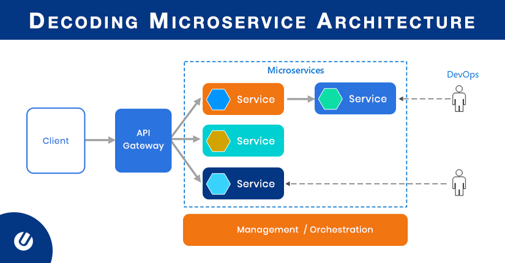

# Microservices

## Comparison between Monolithic and Microservices

| No.|Monolithic|Microservices|
|:---|:---------|:------------|
|1.| Single Code base|Independent services|
|2.| Easy to develop debug and deployments|Better Saclability|
|3.| Complexity|Small, focused teams|
|4.| Hard to maintenance |Agility|
|5.| Challenge of making change|Challenge of management and tracebility|
|6.| Inability to apply new technologies|Technology Diversity|

**Sample Microservice Architecture**

If you want to understand docker then you can refer this [link](../../Docker/README.md)