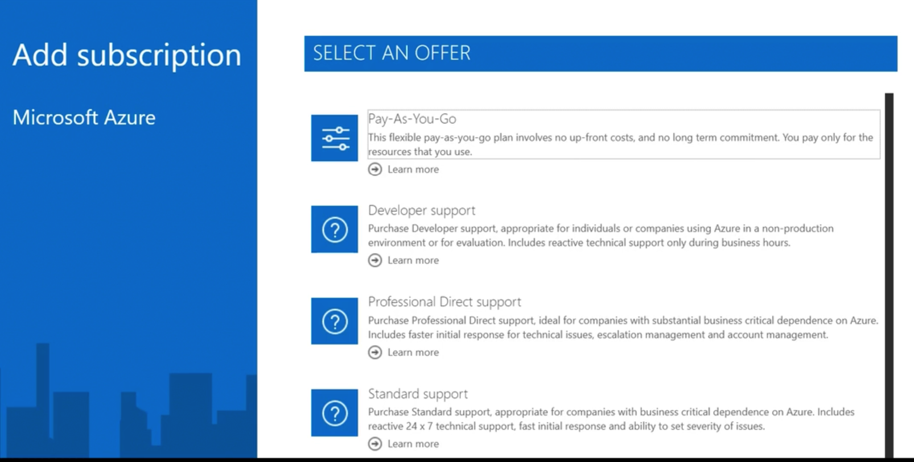
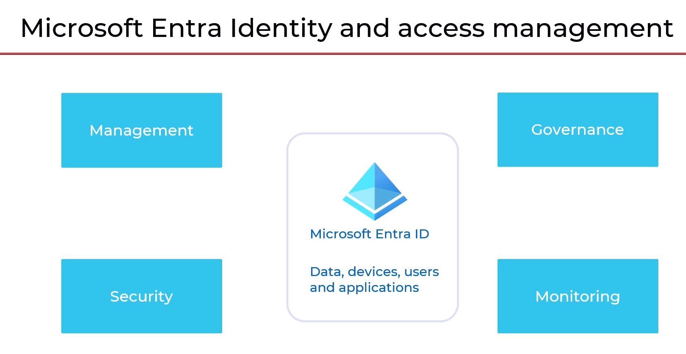
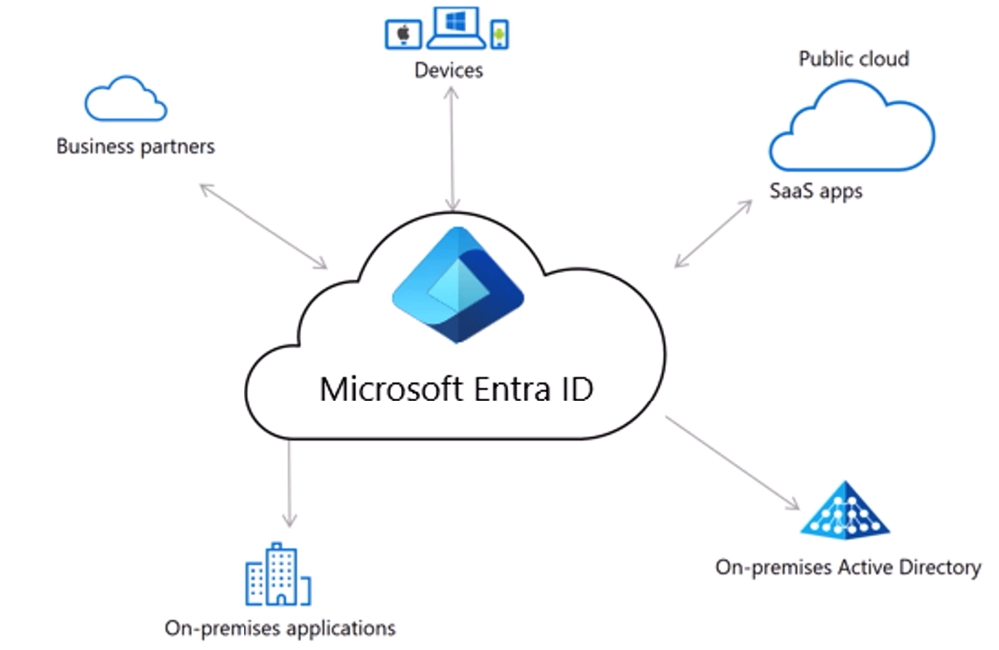
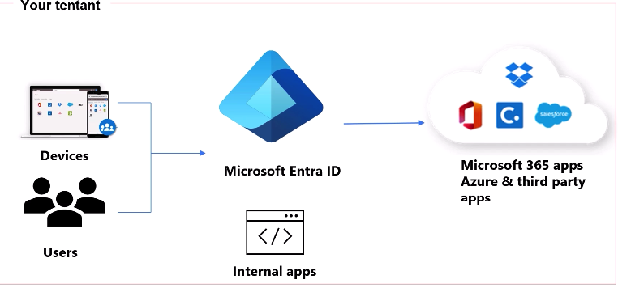

[Parent](../README.md)

## Understanding Azure Subscriptions
We can have subscription for every environment as well.

Different types of roles
- Account Administrator - One per Azure account.
- Service Administrator - One per Azure subscription
- Co-Administrator - Equivalent to owner privilege in the subscription level

Different type of subscription plan

### Microsoft Entra Identity and access management

#### IAM Concepts
Controlling access. Control on subject over object. To check whether they have right permission to access right object.

**IAM Framework**  

Identity -> Authentication -> Authorization -> Resources

- User Management
- Group Management
- Device Management
- Application Management

Single Sign on
Self-service password reset
Multi-factor authentication
Conditional Access
Privileged Identity Management (PIM)

## Microsoft Entra
Microsoft Entra is family of multicloud identity and network access
solutions trom Microsoft.
A suit of products that helps organizations manage and secure access to their applications, data and resources. 

Three categories
- Identity and Access Management
    - Microsoft Entra ID
    - Microsoft Entra ID Governance
    - Microsoft Entra External ID
- New Identity Categories
    - Microsoft Entra Verified ID
    - Microsoft Entra Permsisions Management
    - Microsoft Entra Workload ID
    
- Network Access
    - Microsoft Entra Internet Access
    - Micrsoft Entra Private Access

#### Microsoft Entra ID
Microsoft Entra Id is a clod based identity and access management solution

- Identity Provider - A system that handles creation, managament and storage of digital identities
- Identity - An object in the Microsoft Entra ID that gets authenticated. Used to assign rights and access to resources
- Tenant - A tenant is a digital representation of an organization, like whizlabs.com
- Account - An identity that has data associated with it
- User - A verified account associated with a person

#### Key Features
- User Management
- Authentication, Single signon & MFA
- Autorization & role based permission
- Security, Compliance & auditing.

https://entra.microsoft.com/#view/Microsoft_AAD_IAM/TenantOverview.ReactView

The above is the tool built by microsoft for Identity Management

**Workflow**
- Every cloud service requires Identity
- Every subscriptions are connected to one Entra ID
- Tenants could be connected a subscription
- Entra informaiton is being accessed by EntraId Global admin

Two types of Tenant
- Workforce tenant 
    - Default Tenant where we used everywhere
    - External identity and guest users
    - Microsoft Entra accounts
- Customer Tenant - 
    - If we want to give to customer then we can use it
    - Customer accounts
    - Use a local account or google/facebook sign-in

