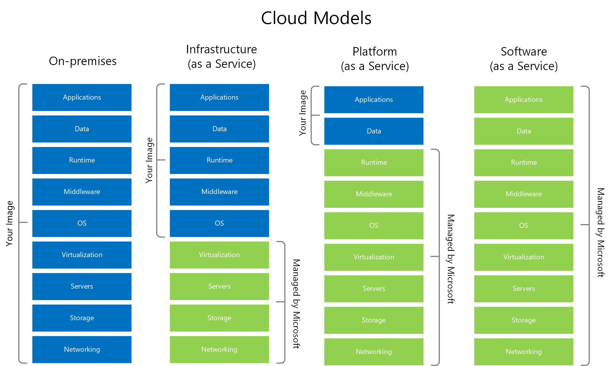
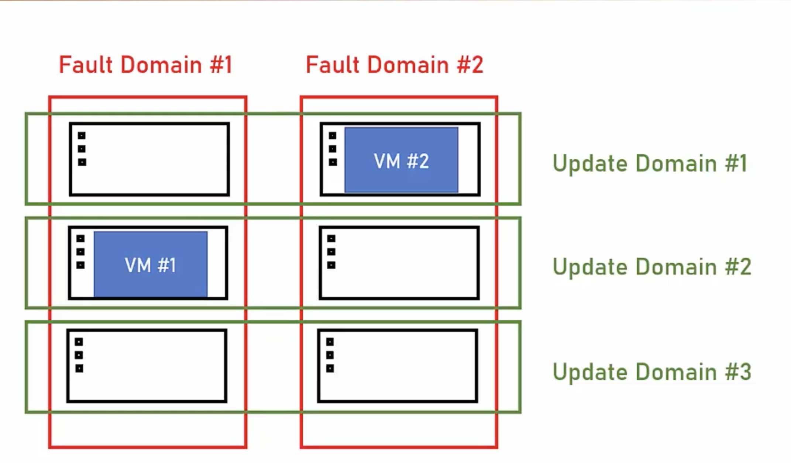
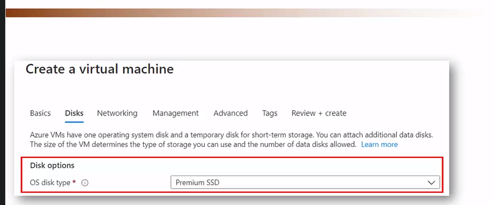

# Cloud Technology

## Characteristics of Cloud computing
- On-Demand Self Service
- Borad Network Access
- Resource Pooling
- Rapid Elasticity
- Measured Service

## Overview

Cloud platform helps in many aspects. Elasticity, consistency, security, cost etc. Cloud works based on OpEX model and not CapEX model

#### CapEX
Capital Expense: Where the complete money is invested upfront by just forcasting. But it doesnt necessarily be fully utilised.
> Traditional IT is CapEx oriented. Buying space, server, AC, Maintanence etc..

- Non optimal
- Not flexible


#### OpEX
Operational Expense: Where the amount is paid based on operation performed and not upfront. Which is much cheaper when it comes to enterprise applications.

- Extremely Flexible
- More optimal

## Different types of Cloud Service

#### Iaas - Infrastructure as a service
The cloud provide underlying platform
- Compute
- Networking
- Storage

>  Eg:  Virtual Machines


#### Paas - Platform as a service
The cloud provide platform for running apps
Including: Compute, networking, storage, runtime, environments etc
> Eg : Web apps. We dont have access to Virtual machine for this
#### Saas - Software as a service
Software running in cloud. We dont have to install anything. We can just use part of the software but we will not be able to access any insfrastructure. 


Source: https://learn.microsoft.com/en-us/azure/cloud-adoption-framework/strategy/monitoring-strategy

#### Faas - Function as a service
#### Daas - Database as a service
#### IOTaas - IOT as a service
#### AIaas - AI as a service


## Types of cloud
- Public Cloud
    - Cloud setup in public network
    - Managed by large companies
    - Accessed through internet
- Private Cloud
    - Cloud set up in organization's premises
    - Managed by the Orgranization's IT team
    - Accessible only in the organization's network
    - Openshift
- Hybrid Cloud
    - A cloud setup in an organization premises
    - but also connected to public cloud
    - Workload can be seperated between two clouds
    - i.e Sensitive data in the organization premises, public data in the public cloud
    - Usually managed by the public cloud, but not always.
    Eg: Azure Arc, AWS Outposts 

## Subscription
Whenever a new account is created there will be a subscription tagged to that.

## Region
Datacenter built around the globes at different locations are called region. There are ~60 regions avaialble for Microsoft Azure. Almost every new resource we create should be allocated to Region. And each physical data centers are called **Zones**. There are possiblities that a Region may contain more than one Zone.

## Paired Region
Concept of where there will be pair region for some Regions. This is because in case if one region failed then other will fulfil this. Pairs are set by Azure and we dont have control over it.

## Resource Group
Resource Group is a logical container for resources. It is used to to contain resource in logical boundary. Every Service need to be bound to resource group. Resource Groups are **Free** to create.

we can create Azure resource group with the help of portal or through command prompt as well

Bash command
```bash
az group create -l centralindia -n CLITest-rg
```
Same activity can be done with Powershell instead of CLI and here is the command for that

Powershell command
```powershell
New-AzResourceGroup -Name PSTest-rg -location centralindia
```

Creating resource group

You can use search bar to search resource group, by typing resource name

#### Region
Selecting region is very important with respect to Region.
- Geographical proximity to System-s audience- Choosing users closest to Target audience
- Services availability.
https://azure.microsoft.com/en-us/explore/global-infrastructure/products-by-region/

- Availability Zone - Support of Availability zones
- Pricing - Pricing changes from region to region
#### Resource Group
- A logic container for resources
- Used for grouping resources by a logic boundary
- Free
- Examples
    - Development/Test/Production resources
    - Team A resources/ Team B resources
> Subscription is also a logical container

https://learn.microsoft.com/en-us/azure/cloud-adoption-framework/ready/azure-setup-guide/organize-resources?tabs=AzureManagementGroupsAndHierarchy

>Management groups are used to manage multiple subscriptions

- Its best practice to have an **rg** or **RG** as part of resource group name
- Could be prefix or suffix
    - RG-Project-Dev
    - Finance-Resources-rg

- Almost every resource in Azure is placed in a Resource Group


#### Resource Group vs Subscription
Subscription has associated account and cost center. Subscription is an account level container. Resource Groups are logical container for resources.

#### Naming Convention
Resource group has naming convention. Its better to have **rg-** or **-rg** as prefix or suffix respectively

## Storage Account
Used to store almost anything. Used transparently by any service in Azure. Eg, Database backup, VMs, Diagnostic Data.

## SLA
Service Level Agreement - The uptime% of a cloud service.


There is a way to calculate SLA's using the tool called [UpTime](https://uptime.is)

## Cost
In cloud everything is Cost.
- Per Resource (For eg,VM)
- Per Consumption (For eg, Function Apps)
- Reservations - Certain amount of time.

Always check cost before provisioning

To Check any pricing upfront make sure we use [Azure Calculator](https://azure.microsoft.com/en-in/pricing/calculator/)

Cost management + Billing : Will help to form the budget

## VSCode Extensions for Azure
- Azure Account
- Azure App Service

## Different ways to reduce VM Cost
- **Auto Shutdown**
- **Reserved Instances**
- **Spot Instances** - Using unused server for VM, which can be dropped anytime by Azure with short notice.

## Availability
There are four types of Availability concpets.


#### Fault Domain
If the server is placed in a rack and if there is any network problem to that rack or any physical damage to that rack, the entire servers inside that rack will go down. So making sure the VM's or server spread across multiple racks will sort out Fault Domain problem.

#### Update Domain
Sometimes there is a posibility that domain may undergo maintanence activity. Due to security update or my be of multiple reason. And all the servers for an application is in same logical domain then when it undergoes maintainence activity then the application will go down. So its better to split it across multiple logical domain, so that if one goes on maintanence other will be there to serve request.



The best way to avoid Fault domain is deploying across different region in Availability zone. This ensure that not all server will shutdown simultaneously.

- Availability Zone
- Availability Set

## Azure Resource Management (ARM) Template
A JSON file which contains complete details about what configuration we have defined while creating a new resource.
It can be exported, imported, modified and reused for creating the clone of resource based on configuration mentioned in ARM template. It is very important to use while automation.

## Resource Proviers
Resource providers are the list of capabilities available for subscriptions. Once narrow down to subscription we have to find resource providers. In that there will be a list of resources which have already capabilities registered. If there is which is not regisitered then we can select that capability and register it. It will take some time to get registration completed. To check the status we can use batch command. 

```shell
az provider show--namespace microsoft.insight -o table
```

## Azure Compute
- Set of cloud services for hosting and running applications
- Allows uploading your code and then running it
- Offers various levels of control and flexibility

There are 4 types of compute services
- Virtual Machines
- App Services
- AKS
- Azure Function

### Virtual Machines
- A Virtual server running on a physical server
- Allows creating new servers extremly quick
- Based on existing resources of the physical server
- From the user's point of view - a regular server, nothing new
- Called as **Unmanaged service**
- Eg: Azure wont manage anything we have to manage everything
- **VM Density** - Is number of Virtual machines per host

#### Steps for creating Virtual Machines
- Select the location
- Select the image (OS + Pre-Installed Software)
- Select the size
- *Dont forget to check price*

#### Cost of VM's includes following items
- VM
- Disk
- IP
- Storage

To Check any pricing upfront make sure we use [Azure Calculator](https://azure.microsoft.com/en-in/pricing/calculator/)

#### How to reduce cost
- Auto Shutdown - Point to remember is though VM's are shutdown, IP and Network cost will still incur
    - Reduce more than 50% of the cost
- Reserved Instances - For 1-3 years, will have reduced cost. Mainly used for Production machine.
    - Offers great price and can reduce up to 60% of the listed price
    - Can be divided to pay monthly
    - **Once started can never be reverted back**
- Spot Instances - Machine that run on Unused capacity in Azure. Can be evicted any moment when needed by Azure
    - You will receive very short notification for evicting your machine
    - Great for non critical projects

- Disk optimization - Make sure to select the right disk for the machine. Default is premium SSD - the most expensive option. Non IO- intesive machines can do with Standard SSD. Disk type affects SLA

    - App servers or Cache server can use Non IO- intensive machines.
    - High disk operation can use Premium SSD
- Always select right size for your machine.
    - CPU shouldn't rest. Make sure CPU utilization should be around 70%.
- Select Linux over windows when possible
- Check price in nearby regions

#### Availability of VM
There are multiple SLA's available.
- With Premium SSD the SLA is 99.99%
- With Standard SSD the SLA is 99.5%
- With standard HDD the SLA is 95%

#### Availability concepts in Azure
There are four availability concepts
- Fault Domain
- Update Domain
- Availability Set
- Availability zone

Fault Domain
- Fault Domain is a logical group of physical hardwares that share a common power source and network switch
- we have to make sure that we select servers from more than one Fault Domain

Update Domain
- Update Domain is a logical group of physical hardwards that goes on server upgrades, rebooting etc
- We have to make sure that we select servers from more than one Update Domain
- Update domain is not like Fault domain, but it is just a logical grouping. Doesnt necessarily has to be at the same rack like Fault domain


Availability Set
- A collection of Fault domain and Update domains a virtual machine will be spread across
- Can contain upto 3 Fault domains and up to 20 update domains 
- All domains (Fault and Update) domain in same location
- Deploy identical VM's in to the same Availaiblity set
- If needed - deploy load balancers to route between the VMs
- Availability set is free, you pay only for the additional PM's

Availaiblity Zone
- A building contain autonomus data center. 
- A physically seperate zone
- Each zone functions as a fault & update domain
- Provides protection against a complete zone shutdown - Better SLA
- Deploy identitcal VMs into seperte Availabiltiy zone in the same region
- Ensure they wont shut down simultanteously when the zone is shut down
- If needed - deploy load balancer to route between the VMs


#### Creating Available and Cost effective VM
- Go to search and type Virtual Machine
- Create a new one
-  create Resource Group
- Create VM Name, Region, Availabiltiy Option
- Select Availability option as Availaiblity Zone
- If availability zone is not there create a new one. When creating make sure you have selected Fault Domain as 2 approx and Update Domain as 3 approx for non production environment
- Availability Zones will not be there for all the regions
- If Availability zone is not present for a particular region then selected Availability set
- Select Operating system (For eg: Windows server 2019 Data center) , then Select Vcpus (2) and RAM (8gig) etc...
- Provide admin user name and password
- then instead of creating VM directly go to disk section.
- Remember that by default Premium SSD will be selected. We have to make sure that do we really require that.
- In the Management section  go to AutoShutDown and setup the configuration. This will save lot of money
- Before creating there is an option for ARM template to download


#### ARM Template
- Azure Resource Manager Template
- A Json file describing the resources to be created
- used by Azure in all deployments
- Can be exported modified, uploaded deployed
- Can also be created from scratch
- ARM template is a decalarative way of deploying resources
    - Declarative
        - Describes the end result
        - Allows "What-if" operation
        - Can deploy multiple resources at once
        - Can be integrated in CI/CD processes
        - Can be source controlled
    - Imperative
        - Sends instruction to run
        - Error prone
        - Can't be verified
        - Can't be source controlled
        - Suited for quick and dirty operations

> If i want to create some quick virtual machine then i can use Imperative method whereas if you want to create a complete Azure environment then Declaratice method can be used

ARM Template - When we download will have two files, *parameters.json* and *template.json*
