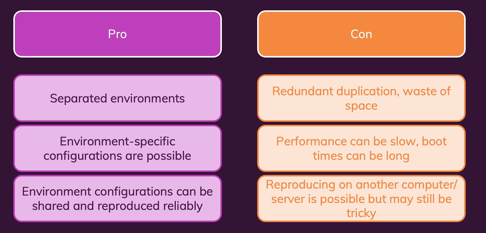

# Docker and Containier
Containers contains both run time and the code which is required to run application
####Virtual Machines


####Docker


####Creating our own Docker Image
- Create a new docker file named *Dockerfile* (File name should be in exact case. It is case sensitive)
- Make sure Extension is installed in Visual Studio Code for Docker
- Now start writing extension
```docker
FROM node
# Setting Working directory
WORKDIR /app
# By default we have to specify . for copying everything to Root folder.
# Whereas if you want it inside particular folder then specify in second '.'
COPY . /app

# If we dont set working directory by default it will execute this command in root folder
RUN npm install
# Port expose has to be done, because Docker is running in isolation environment.
EXPOSE 80
# Remember we cannot use node server.js because this image file will help to build 
# So we dont have to run node server.js but rather pass it in CMD 
CMD ["node", "server.js"]
```
- Build docker image - with the folliwngl command. It will create docker image.
```bash
docker build . # Here represent current path where this command is running. If needed different path then specify full path there
docker build -t nodeapp1 . # -t provides name to the built image
```
>It will take a while to build based on what image we are pulling.

*Output:*
```
[+] Building 4.1s (10/10) FINISHED
 => [internal] load build definition from Dockerfile                                              0.0s 
 => => transferring dockerfile: 32B                                                               0.0s 
 => [internal] load .dockerignore                                                                 0.0s 
 => => transferring context: 2B                                                                   0.0s 
 => [internal] load metadata for docker.io/library/node:latest                                    3.9s 
 => [auth] library/node:pull token for registry-1.docker.io                                       0.0s 
 => [internal] load build context                                                                 0.1s 
 => => transferring context: 27.80kB                                                              0.1s 
 => [1/4] FROM docker.io/library/node@sha256:f90e576f924bd8250a5b17923e7879e93abac1991ad6053674a  0.0s 
 => CACHED [2/4] WORKDIR /app                                                                     0.0s 
 => CACHED [3/4] COPY . /app                                                                      0.0s 
 => CACHED [4/4] RUN npm install                                                                  0.0s 
 => exporting to image                                                                            0.0s 
 => => exporting layers
```
- To see list of images which our Docker has
```bash
docker images
```
*Output:*
```
REPOSITORY               TAG       IMAGE ID       CREATED          SIZE
nodeapp1                 latest    effe3b644f42   32 minutes ago   993MB
postgres                 latest    5cd1494671e9   9 days ago       376MB
docker/getting-started   latest    bd9a9f733898   6 weeks ago      28.8MB
```
- To see what is currenly running right now
```bash
docker ps
```

*Output:*
```
CONTAINER ID   IMAGE     COMMAND   CREATED   STATUS    PORTS     NAMES
```
- To run the image which we created
```bash
docker run effe3b644f42 #Image id which we have created
or
docker run nodeapp1
or 
docker run -d nodeapp1 # Initiates deamon, which will run in background 
```
The moment this command is executed the command prompt will not reply anything and it keeps running

If we execute  `docker ps` command after executing `docker run` command then following output will be shown

*Output:*
```
CONTAINER ID   IMAGE      COMMAND                  CREATED         STATUS         PORTS     NAMES
99aceb8e072d   nodeapp1   "docker-entrypoint.s…"   4 seconds ago   Up 6 seconds   80/tcp    stoic_noether
```
- To stop current running image , we have to use *Names*
```bash
docker stop stoic_noether # This will take a while to stop, but it will stop 
```
- Just `docker run` will not give the desired output. We have to make sure we bind the port properly
```bash
docker run -p 3000:80 nodeapp1 # -p stands for port
# 3000 stands for destination port
# 80 stands for the exposed port in Docker File 'EXPOSE 80'
```
Output will be produced.

