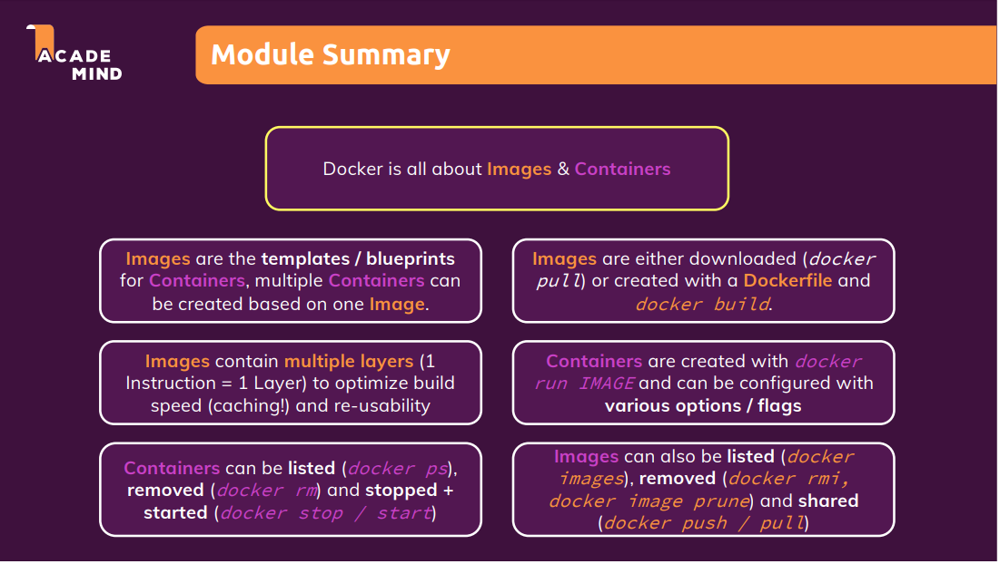

# Docker and Containier
Containers contains both run time and the code which is required to run application
### Virtual Machines


### Docker


### Creating our own Docker Image
- Create a new docker file named *Dockerfile* (File name should be in exact case. It is case sensitive)
- Make sure Extension is installed in Visual Studio Code for Docker
- Now start writing extension
```docker
FROM node
# Setting Working directory, if we use "node:14" then it will pull 14 version of node
WORKDIR /app
# By default we have to specify . for copying everything to Root folder.
# Whereas if you want it inside particular folder then specify in second '.'
COPY . /app

# If we dont set working directory by default it will execute this command in root folder
RUN npm install
# Port expose has to be done, because Docker is running in isolation environment.
EXPOSE 80
# Remember we cannot use node server.js because this image file will help to build 
# So we dont have to run node server.js but rather pass it in CMD 
CMD ["node", "server.js"]
```
- Build docker image - with the folliwngl command. It will create docker image.
```bash
docker build . # Here represent current path where this command is running. If needed different path then specify full path there
docker build -t nodeapp1 . # -t provides name to the built image
```
>It will take a while to build based on what image we are pulling.

*Output:*
```
[+] Building 4.1s (10/10) FINISHED
 => [internal] load build definition from Dockerfile                                              0.0s 
 => => transferring dockerfile: 32B                                                               0.0s 
 => [internal] load .dockerignore                                                                 0.0s 
 => => transferring context: 2B                                                                   0.0s 
 => [internal] load metadata for docker.io/library/node:latest                                    3.9s 
 => [auth] library/node:pull token for registry-1.docker.io                                       0.0s 
 => [internal] load build context                                                                 0.1s 
 => => transferring context: 27.80kB                                                              0.1s 
 => [1/4] FROM docker.io/library/node@sha256:f90e576f924bd8250a5b17923e7879e93abac1991ad6053674a  0.0s 
 => CACHED [2/4] WORKDIR /app                                                                     0.0s 
 => CACHED [3/4] COPY . /app                                                                      0.0s 
 => CACHED [4/4] RUN npm install                                                                  0.0s 
 => exporting to image                                                                            0.0s 
 => => exporting layers
```
- To see list of images which our Docker has
```bash
docker images
```
*Output:*
```
REPOSITORY               TAG       IMAGE ID       CREATED          SIZE
nodeapp1                 latest    effe3b644f42   32 minutes ago   993MB
postgres                 latest    5cd1494671e9   9 days ago       376MB
docker/getting-started   latest    bd9a9f733898   6 weeks ago      28.8MB
```
- To see what is currenly running right now
```bash
docker ps
```

*Output:*
```
CONTAINER ID   IMAGE     COMMAND   CREATED   STATUS    PORTS     NAMES
```
- To run the image which we created
```bash
docker run effe3b644f42 #Image id which we have created
or
docker run nodeapp1
or 
docker run -d nodeapp1 # Initiates deamon, which will run in background 
```
The moment this command is executed the command prompt will not reply anything and it keeps running

If we execute  `docker ps` command after executing `docker run` command then following output will be shown

*Output:*
```
CONTAINER ID   IMAGE      COMMAND                  CREATED         STATUS         PORTS     NAMES
99aceb8e072d   nodeapp1   "docker-entrypoint.s…"   4 seconds ago   Up 6 seconds   80/tcp    stoic_noether
```
- To stop current running image , we have to use *Names*
```bash
docker stop stoic_noether # This will take a while to stop, but it will stop 
```
- Just `docker run` will not give the desired output. We have to make sure we bind the port properly
```bash
docker run -p 3000:80 nodeapp1 # -p stands for port
# 3000 stands for destination port
# 80 stands for the exposed port in Docker File 'EXPOSE 80'
```
Output will be produced.

### Images are Readonly
- Images are readonly. whenever there is any change in the code it will not automatically updated to image. We have to rebuild to make sure that we accomodate that change in image.

>We have to rebuild image to accomodate changes. Changes we made only those will be accomodated to existing file. Everything will be cached

- Images are layered. Everytime things changes, it keep adding more and more layesr on top of the exisitng image.
- Once there is any one step it got changed then all subsequeent will be rebuilt, and it will not be taken from Cache.

In the above docker script we can rearrange little bit to make sure that it is performance efficient.

```docker
FROM node
# Setting Working directory
WORKDIR /app
# When we copy only package.json then npm install will run only this based on package.json.
# By doing so If there is any code change then it will not run npm install even for code change
# other than package.json. 
COPY package.json /app
# If we dont set working directory by default it will execute this command in root folder
RUN npm install
# By default we have to specify . for copying everything to Root folder.
# Whereas if you want it inside particular folder then specify in second '.'
COPY . /app
# Port expose has to be done, because Docker is running in isolation environment.
EXPOSE 80
# Remember we cannot use node server.js because this image file will help to build 
# So we dont have to run node server.js but rather pass it in CMD. Later it will be executed in context when we run image not by default.
CMD ["node", "server.js"]
```
You can see that we have added one more copy which copies package.json file from source to destination. After that we are calling npm install. This makes sure that only when there is a package change it will call npm install (It will be pulled from `Cache`) otherwise code can be accomodated very well without running `npm install`

### Stopping and restarting containers
- `docker --help` will bring whole lot of list which we can use to control docker.
- `docker ps -a` will bring all the containers even history of containers we have stopped as well.
- `docker start <container-name>` will start the container back again, so we dont have to creat the containers again and again. 
And always it runs in **detached** mode. It runs in *background* mode.  `docker run <image name>` will instantiate new containers. And by default it runs in **attached** mode. And it runs in *foreground* mode
```bash
docker start <container-name> # Will start the container. To see list of all stopped conainers then docker ps -a
docker start -a <container-name> # Will start the container with attached mode.
```
>This is not similar to docker run, because docker run will hold the command prompt from entering any new command. Whereas docker start will just instantiate the container.
- `docker stop <container-name>` will stop the container
- Attched mode will freeze that complete command prompt and hold it right there. Whereas detached mode will run in background and make sure that command prompt is used for further use. Especially if we are using `Console.log` for anything
- If we want to use `docker run` in **detached mode**, then this command will help

```bash
docker run -p 3000:80 -d nodeapp1 # -d stands for detached mode
```
- If we want to convert it back to attached mode then

```bash
docker attach <container-name> # docker --help will give many useful commands
```
- If we want to see the history of logs which that container generated
```bash
docker logs <container-name> #docker ps will give you the name of running containers
```
- If we have to keep following up with that logs for future logs
```bash
docker logs -f <container-name> # -f stands for future logs. All other options we can get it by docker logs --help
```
### Working with interactive terminal
All the above mentioned command works well when we has web server. But how are we going to deal with this.
Assume below mentioned pythong docker file
*Dockerfile*
```bash
FROM python

WORKDIR /app

COPY . /app

CMD ["python","rng.py"]
```
*rng.py*
```python
from random import randint

min_number = int(input('Please enter the min number: '))
max_number = int(input('Please enter the max number: '))

if (max_number < min_number): 
  print('Invalid input - shutting down...')
else:
  rnd_number = randint(min_number, max_number)
  print(rnd_number)

```
The above mentioned Docker file seemed to be very usual and puthon file mentioned above excepts two parameters and it gives random number as an output

To get interactive terminal if we just give `docker run` it will throw below error
```bash
$ docker run pythonapp1
Please enter the min number: Traceback (most recent call last):
  File "/app/rng.py", line 3, in <module>
    min_number = int(input('Please enter the min number: '))
EOFError: EOF when reading a line
```
So to make it work properly `docker run --help`  has huge help list.
Couple of them are
`-i` - Initiates interactive mode
`-t` - Allocate a pseudo-TTY

Now combined together
`docker run -i -t pythonapp1` - Will initiates interactive mode


If we stop the container and restart it, and it we have to use that
just docker start will not help
```bash
docker start -a -i blissful_aryabhata 
# blissful_aryabhata - Container name
# -a Will help to attach the container. Remember by default container will be started with detached mode
# -i Will help to start the container with interactive mode. 
# Just in case help needed docker start --help
```

### Delete images and containers
- To remove containers we can use `docker rm <container-name>`
>We cannot remove running container. If we try to remove running container it will show up error

```bash
docker rm frosty_austin stoic_noether
# we can provide multiple containers by seperating with space
```
- We can even remove all the stopped containers at once
```bash
docker container prune
```
- To remove images

```bash
docker rmi effe3b644f42 
# effe3b644f42 is an image id
```
> We cannot remove image if there is any containers associated to that image. It doesn't matter if it is stopped or in running state. Still the container has to be deleted before removing image.

- To remove all images at once
```bash
docker image prune # All unused images will be removed
```
- To remove multiple images

```bash
docker rmi effe3b644f42 bvch9b644f42
```

### Removing stopped containers automatically
To remove containers automatically once container is exited.

```bash
docker run -p 3000:80 -d --rm -t nodeapp1
# --rm is nothing but to remove container once it is stopped.
# -d detached mode
# -t tag
# -p port
```
> docker run --help

### Inspecting images
In case if you would like to know images in detail, then this command will be helpful

```bash
docker inspect <image-name>
```

### Copying Files In & Out from a Container
If we want to look in to container and add or extract items from the container

Assuming following scenario. Create a folder called `Test` and `test.txt` inside that. Now if we want to copy this inside container then following command will be used.
```bash
docker cp test/. <container-name>:/newtestfolder # test/. is nothing but copy all the files inside test folder.
# <container-name> =  Name of the container 
# : = Colon is the seperator
# /newtestfolder = Is where we should copy these files

docker cp test/. boring_king:/newtestfolder
```
To copy the files back from image the same command needs to be rearranged little bit

```bash
docker cp <container-name>:/newtestfolder/. test
# This code will copy all files from new test folder to test folder in our local.
# if we want to specify certain files still that is possible by providing file name instead of .
```
> This will be useful if we want to copy configuration files. Or to copy log files from container to local.

### Naming and Tagging Containers and Images
To name the container we can use `--name`
```bash
docker run -p 3000:80 -d --name goalapp nodeapp1
# --name goalapp is the way to set container name to goalapp
```
To name the image we can use `-t`
```bash
docker build -t nodeapp1 . # This will create a image with name nodeapp1
docker build -t nodeapp1:latest . # nodeapp1:latest represents the version tag.
# We can provide whatever version value we want.
# To run this we can use
docker run -d --rm -p 8000:80 nodeapp1:latest
```
### Sharing Images - Overview


### Pushing images to Docker Hub
Docker images can be pushed to two different locations

Following are the steps which are need to be done
- Create an account in Docker Hub
- Create a public repository. For Free tier max 1 private repositpry can be created
- To push repository in to the docker hub we have to use `docker push IMAGE_NAME`
- Point to Note: Docker image name should be same as the one in docker hub repository

If docker image name is not same then we can get that image name in two ways
- Build the whole image with that new name
```bash
docker build -t vinothvsbe/ass-node-app .
```
- Change name of the existing name to new name
```bash
docker tag ass-node-app:latest vinothvsbe/ass-node-app
# :latest tag name is optional
# Even this above command will create a clone of the image doesnt rename existing one directly.
``` 

You cannot push images directly to docker hub directly due to security reason. So to enable pushing we have to login first.

```bash
docker login
# once the above command request for user name and password
docker logout
# for force loging out

docker login -u "username" -p "password" docker.io
# This above command can also help
```

> By default all the commands towards repository will be redirected to docker hub only. If we need to connect to Private repository then full url has to be given.


### Pulling and using Shared images
To pull the shared image following command will be used
```bash
docker pull vinothvsbe/ass-node-app # It will pull latest image in repository
docker run vinothvsbe/ass-node-app 
```



### Key Docker Commands - Cheat sheet
For a full list of all commands, add --help after a command - e.g. docker --help , docker run
--help etc.
Also view the official docs for a full, detailed documentation of ALL commands and features: https:
//docs.docker.com/engine/reference/run/
**Important:** This can be overwhelming! You'll only need a fraction of those features and
commands in reality!
- docker build . : Build a Dockerfile and create your own Image based on the file
  - -t NAME:TAG : Assign a NAME and a TAG to an image
- docker run IMAGE_NAME : Create and start a new container based on image IMAGENAME (or
use the image id)
  - --name NAME : Assign a NAME to the container. The name can be used for stopping and
removing etc.
  - -d : Run the container in **detached** mode - i.e. output printed by the container is not
visible, the command prompt / terminal does NOT wait for the container to stop
  - -it : Run the container in "**interactive**" mode - the container / application is then
prepared to receive input via the command prompt / terminal. You can stop the
container with CTRL + C when using the -it flag
  - --rm : Automatically **remove** the container when it's stopped
- docker ps : **List all** running containers
  - -a : **List all** containers - including **stopped** ones
- docker images : List all **locally** stored images
- docker rm CONTAINER : **Remove** a container with name **CONTAINER** (you can also use the
container id)
- docker rmi IMAGE : **Remove** an **image** by name / id
- docker container prune : Remove all **stopped** containers
- docker image prune : Remove all **dangling** images (untagged images)
  - -a : Remove **all** locally stored images
- docker push IMAGE : **Push** an image to **DockerHub** (or another registry) - the image name/
tag must include the repository name/ url
- docker pull IMAGE : **Pull** (download) an image from **DockerHub** (or another registry) - this
is done automatically if you just docker run IMAGE and the image wasn't pulled before


### Managing Data and Working with Volumes
When we try to store any data in containers that will be available till the container is removed.
> This means that even if the container is stopped data stored in container layter willstill be active and not removed

- `Images are always readonly. Data can never be modified inside image.Whatever stored is stored only in container layer`

- The best solution is `volumes` for this.

- Volmes store information in to local drives and then that will be made available in to containers

- Volume persisit data even when containers are removed, because data will be stored inside the local machine and not on the containers

**Types of volume**

**Anonymous Volume** - There wont be any name for the volume
```docker
FROM node

WORKDIR /app

COPY package.json /app

RUN npm install

COPY . /app

EXPOSE 80

VOLUME [ "/app/feedback" ]

CMD ["node","server.js"]
```
```bash
docker run --name feedback-app -d --rm -p 3000:80  feedback-node:volume
```
When we run this there wont be any problem,but once container is stopped then files will not be accessible once container is restarted

To see list of volumes following command has to be used
```bash
docker volume ls

DRIVER    VOLUME NAME
local     fe804e522b95a028decad888b6e2b87f96adbf9b8f5f0d40d47510312eb4f3ac
```
> When we have anonymous volume then everytime the container starts it will create new volume

**Named Volume** - There will be name assigned for that volume

- With this now we will be able to access old volumes.
- To create Named Volume we dont have to specify that in Dockerfile, but in command prompt

```bash
docker run --name feedback-app -d --rm -p 3000:80 -v feedback:/app/feedback  feedback-node:volume
# -v - Represents Volume
# feedback: - Represents the name of the volume
# /app/feedback - Represents from where we have to copy
```

```bash
docker volume ls

DRIVER    VOLUME NAME
local     feedback
```
You can  clean the unused volume name by using following commands

```bash
docker volume rm <Volume_Name> # remove specific <Volume_Name>
docker volume prune # Removes all unused Volumes
```

### Getting started with Bind Mounts
Differene between Volumes and Bind Mounts is, 
- Volumes will be managed by Docker whereas Bind mount will be our custom written path.
- If we use Volume then the files will be placed from within container to outside of contaienrs. Whereas Binding is something from external location to internal it will be mapped.

Following command shows that we can place the files from our local to containers and it will be referred as well. So that any changes in that file will be reflected inside containers.

```bash
docker run -d -p 3000:80 --name feedback-app -v feedback:/app/feedback -v "C:\Vinoth\poc\docker_course\data-volumes-01-starting-setup\data-volumes-01-starting-setup:/app" -v /app/node_modules feedback-node:volume
# -v feedback:/app/feedback is to store feedback data in to named volume
# -v "C:\Vinoth\poc\docker_course\data-volumes-01-starting-setup\data-volumes-01-starting-setup:/app" is to bind all files from my local computer to docker containers
# -v /app/node_modules To create exception while copying files.
# How will it identify which one to take excception and which one to not?
# It depends on length of the path. The path which is smaller will be excepted while copying.
```
> Make sure you execute the above command in normal command prompt and not on Git Bash

Volumes Summary


> **Anonymous Volume** - Used to temporarily have a quick memory


>*Why we still use "Copy . /app" command even after Bind mount?*
Bind mount will be useful only in development. We will not be using bind mound in production. In production we will use only Snapshot. So copying data is necessary.

**Read-only Volume**
By default volumes are `read/write`. To make it only readonly then following command has to be used.

```bash
docker run -d -p 3000:80 --name feedback-app -v feedback:/app/feedback -v "C:\Vinoth\poc\docker_course\data-volumes-01-starting-setup\data-volumes-01-starting-setup:/app:ro" -v /app/temp -v /app/node_modules feedback-node:volume
#ro - is readonly
# The reason why -v /app/temp is there because that makes that folder writable
```

This makes all folders which are writable and rest is read only.

**Managing Docker Volume** 
Docker volume can be managed by below comands
```bash
docker volume ls 
# To list all volumes
docker volume create <Volume Name> 
# Will create named Volume
docker volume create 
# Will create anonymous volume
docker volume rm <Volume-name> 
# Will remove that volume
docker volume prune 
# Will remove all unused volume
docker volume inspect <volumne-name> 
# Will inspect particular volume
```
**.dockerignore**
To ignore certain folders and file while copying we can mention docker ignore.
something like this
```docker
Dockerfile
.git
```
> .dockerignore is similar to .gitignore

**Working with ENV variable**
working with ENV variable is more easy than we think. So what happens is when we try to set ENV variable in docker, then it will become configurable even through argument.
*This is how to create docker file with support to ENV variable*
```docker
FROM node

WORKDIR /app

COPY package.json .

RUN npm install

COPY . .

ENV PORT 80
# PORT is the environment variable and we are setting default value to it which is '80'
EXPOSE $PORT
# That 'PORT' variable can be accessed by using '$PORT'
CMD ["node","server.js"]
```

*This is how to pass argument*
```bash
docker run -d -p 3000:8000 --env PORT=8000 --name 
feedback-app -v feedback:/app/feedback -v "C:\Vinoth\poc\docker_course\data-volumes-01-starting-setup\data-volumes-01-starting-setup:/app" -v /app/node_modules feedback-node:env
# --env is to set environment variable. -e can also be used instead of --env
# PORT=8000 is how we have to assign the PORT number to the variable
# If you notice then -p is mapped against 8000 => -p 3000:8000
```

*How to use that port inside Javascript?*
```javascript
...
...
...
app.listen(process.env.PORT); /*This is how we can access that environment PORT variable.*/

```

*How to create env file?*
Create a file like `.env` and give content like
```
PORT=8000
```

*How to access env file in argument?*
```bash
docker run -d -p 3000:8000 --env-file ./.env --name 
feedback-app -v feedback:/app/feedback -v "C:\Vinoth\poc\docker_course\data-volumes-01-starting-setup\data-volumes-01-starting-setup:/app" -v /app/node_modules feedback-node:env
# --env-file is to point to the file followed by file name
# ./.env - Relative path for the environment file
```

>The use of environment file is you can easily change environment values without chaning the command line argument.

**Using Build Arguments**
Build arguments are nothing but we can set value and lock it while building the image. Take a look at docker file below
```docker
FROM node

WORKDIR /app

COPY package.json .

RUN npm install

COPY . .

ARG DEFAULT_PORT = 80
# This is how the argument need to be set

ENV PORT $DEFAULT_PORT
# This is how the same argument need to be accessed

EXPOSE $PORT

CMD ["node","server.js"]
```

Now how to set values for that Argument during build

```bash
docker build -t feedback-node:dev --build-arg DEFAULT_PORT=8000 .
# This is how to assign values to Argument.
```

### Docker - Cross Container Communication - Networking
Localhost cannot be accessible inside docker environment.

>host.docker.internal should be replaced by localhost

host.docker.internal will be understood internally in docker and it will be translated to IP address internally by docker in code
So wherever we are using localhost in code that needs to be replaced with host.docker.internal.

**Container-Container communication**

To access different container the best way is to use IPAddress.

```bash
docker inspect mongodb
```
```bash
"NetworkSettings": {
            ...
            "GlobalIPv6PrefixLen": 0,
            "IPAddress": "172.17.0.2",
            "IPPrefixLen": 16,
            "IPv6Gateway": "",
            "MacAddress": "02:42:ac:11:00:02",
            "Networks": {
                "bridge": {
                   ...
                }
            }
        }
```

In the above case it is `172.17.0.2`
So we need to use that IP in the url like shown below
```node
mongoose.connect(
  'mongodb://172.17.0.2/favorites',
  { useNewUrlParser: true },
  (err) => {
    if (err) {
      console.log(err);
    } else {
      app.listen(3000);
    }
  }
);
```
Thats it. This is how we can access it.
