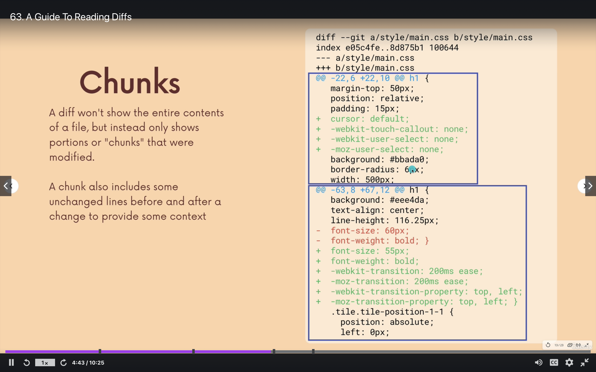

# Git
All git commands and important concepts explained

###Configuring Git
To configure the name/email that git will associate with your work, run this command

``` bash
git config --global user.name "Vinoth Suresh" # To set user name
git config --global user.email "vinothvsbe@gmail.com"  # To set email
```
To check do we already have a name configured then we can use

``` bash
git config user.name # To get user name
git config user.email # To get user email
```

To get complete log of the current git repo
``` bash
git log
git log --oneline #Will provide only summary of the log
```
Get current status
``` bash
git status
```
To Create new repository
``` bash
git init
``` 
>If you want to remove local repository then we need to remove <mark>.git</mark> folder

To add files to staging 
``` bash
git add <filename1> <filename2>  # Provide space between files and folders
git add . # '.' will stage all the files together to staged
```
To commit changes from Staging to local repository

```bash
git commit -m "<Message>" # To commit added items
git commit -a -m "<Message>" # -a will add all the un added files and then it will commit with message. 
#Dont have to call of git add seperately
```

> Keep your commits atomic

Whenever we forgot to type git commit message and just we provide git commit then by default it opens up **Vim** editor. But to work on that is little complicated
By default it asks us to enter commit message. But it is not editable. To make it editable press '**i**'
Then write message and then press '**:wq**' to write and quit editor in command prompt. 
But we can chnage this editor to our default editor like ***Visual Studio Code***

To configure **Visual Studio Code** as a default editor, here is the command for that

``` bash
git config --global core.editor "code --wait" # To configure VS Code
git config core.editor notepad # ToConfigure notepad as editor
```
If you are facing any problem with error message such as <mark>code not found</mark>, its possibly because VS Code wouldn't have got added to path. So the right way is to navigate to VS Code => ⌘+⇧+P (To open command pallette) or Windows + Shift + P (In Windows) => Type "Code" and click "Add code to path"

### Amend
For some reason you forgot to commit a file or you have written wrong commit message. Anything to do with exisitng commit, then you following commands will help

``` bash
git commit -m "Some Commit"
git add <missedFile> # in case if you have missed
git commit --amend # This open up the default editor to 
#change comment in case if you want to change the comment
```
### .gitignore
If we have to ignore following patterns can be used
<mark>\*.txt</mark> -- To ignore text files
<mark>FolderName/</mark> -- To ignore folders use '/' after
<mark>[Ff]olderName/</mark> -- To ignore folder name starts with F capital or small case.
<mark>**/[Pp]ackages/*</mark> -- Wherever Packages folder is there can be ignored and all items inside that will also be ignored

<mark>!**/[Pp]ackages/build/</mark> -- Wherever Packages fodler is there that can be ignored except the Packages folder which contains build folder should not be (!) ignored

## Branching

#### HEAD
HEAD is nothing to pointer for the current branch

Wherever the current branch is HEAD will move to that branch. If branch needs to be changed then HEAD need to be switchted to that branch

Viewing Branch
``` bash
git branch # Shows current branch
```
Whichever has \* is considered to be active branch

To create a new branch
``` bash
git branch <branch-name> #Make sure that it shouldnt include spaces
```
#### Switch
Switching between different branches will be done with the help of 

``` bash
git switch <branch-name> # Switch to existing branch
git switch -c <branch-name> # Create the branch and switch to it
```
switch  <mark>-c</mark> is nothing but create

#### Checkout
Checkout is just similar to Switch but with lot more additional features

``` bash
git checkout <branch-name> # Switch to existing branch
git checkout -b <branch-name> # Create the branch and switch to it
```

>*Whenever we switch the branches if the file which is present accross has conflict then it will not allow you to switch without committing the changes. Whereas if the file is completely new and that file is not present in any branch then you can take that file across any branches without committing.*

#### Deleting and Renaming Branches
To Delete the branch following command will help

``` bash
git branch -d <branch-name> # This will delete the branch if it is new
git branch -D <branch-name> # This will force delete the branch though it is used. 
#But thing to remember is if you want to delete the brancht then HEAD should not be in that branch
git branch -d -f <branch-name> # Just similar to git branch -D <branch-name> . To Force delete
```
To rename the branch
``` bash
git branch -m -f <branch-name> # -m stands for move/rename. 
#The concept is we should be in that current branch to move/rename it. 
#So first switch to the right branch and then execute this command 
```
## Merge

At somepoint we need to merge what is located in branch with main branch (also called as <mark>trunk</mark>).
Following commands in sequence are going to be useful for that

``` bash
git switch main #Always make sure the current branch is destination branch
git merge <branch-name>
```
This is called **Fast Forward Merge**. The reason it is called so because there is no commit from main branch and we are going to merge commits from new branch to the main branch. Its actually simulated as moving master pointer to the new branch pointer.

If there is any changes in Main branch and also in the branch which we have created earlier, then it is no more a Fast forward branch. It requires a commit message and conflict needs to be resolved.

####Merge Conflict
When we merge two branches git will try to do its best to merge changes. But there are some situations where Git will not be able to decide on which side to pick and merge resolve in conflict. On that time git will leave it to us to decide. That is merging conflict

#### Git Diff
Git Diff's are used to find the differences between branches, commits, files and our working directories

We often use Git Diff along side of Git log, Git Status  to get a better picture of a repository and how it has changed over a period of time.

``` bash
git diff
```



From the above picture we can see that (-) symbol is for left side of the file and (+) is for right side of the file. Actually both are same file but Git prtends that it is comparing with newer version of file with older version of file.

In the picture mentioned above has two different section of difference.

And point to be noted is that it usuayll include few lines before and after to exact location where file has changed.

without any options *git diff* will list all changes in the working directory that are not staged for next commit
 
>Compares staging and working directory by default

**Git Diff HEAD**
Git Diff HEAD will bring all changes from repository whether its staged or unstaged

```bash
git diff HEAD
```

> Difference between *git diff* and *git diff HEAD* is first one will bring only changes which is with non staged versus the commit but later one will bring all changes whether those are staged or unstaged

**Git Diff --Staged & Git Diff --Cached**
*git diff --staged* or *git diff --cached* will bring all difference between staged and last commit

```bash
git diff --staged
git diff --cached #Its just alias for --staged
```

**Git Diff --Staged [Specific File Name]**
If we want to view details about a specific file then we can use *git diff --staged [specific file name]*

```bash
git diff --staged [specific file name]
```

**Comparing changes between branches**
If we want to compare difference between two different branches

```bash
git diff branch1..branch2
git diff branch1 branch2 # Just another way of doing the same
```

**Comparing changes between commits**
If we want to compare two different commits then followign command will be useful

```bash
git diff commit1hash..commit2hash
```
>Commit hash is nothing but the hash (alphanumeric) value we  get while we use *git log --online* or *git log*. For eg **d4dc3db**

## Stashing
Git stashing is temporary way of shelving changes so that when we switch current branch without forcing ourselves to checkin stashing allows to have it temporarily placed.

```bash
git stash
git stash save # Is alias of git stash
git stash pop # Used to remove the recently stashed changes and e-apply them to your workign copy
git stash apply # If you want to apply stashed content back to branch and keep stash as it is
```

*git stash apply* will keep stashed content right there. when *pop* is used it will remove stahs from the current stashing location and get that to current branch. But *apply* will keep the stash right there, though it apply the stashed content right there.

>If we stash something and if there is conflict while applying back then it will show merge conflict.

**Stashing multiple times**
Multiple stash can also be added to stash stack


