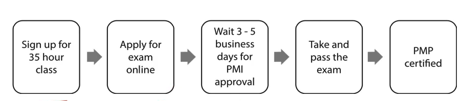
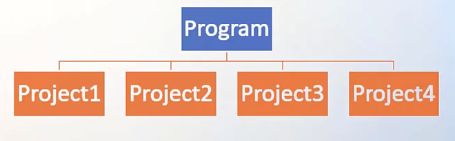
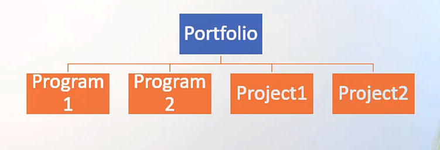
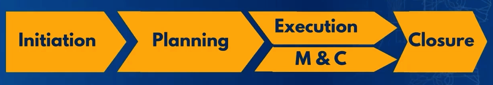
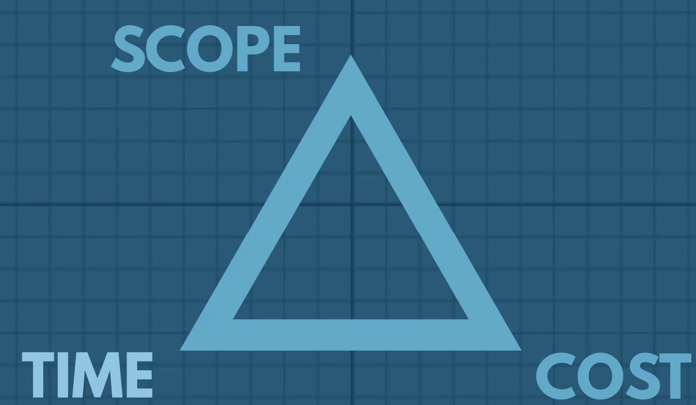
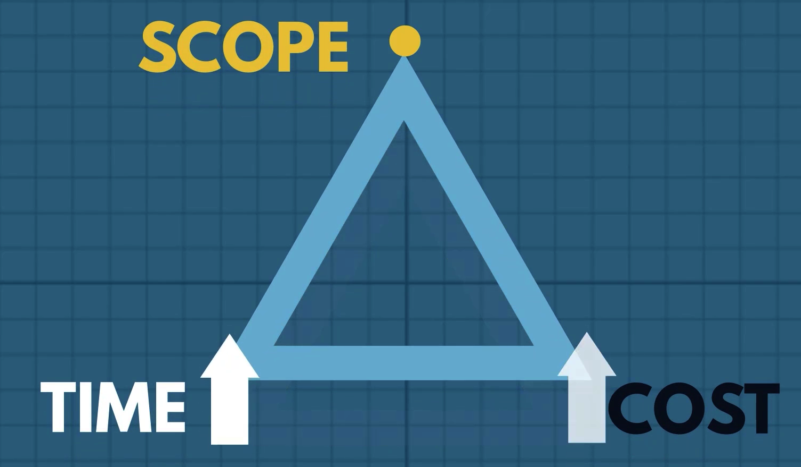
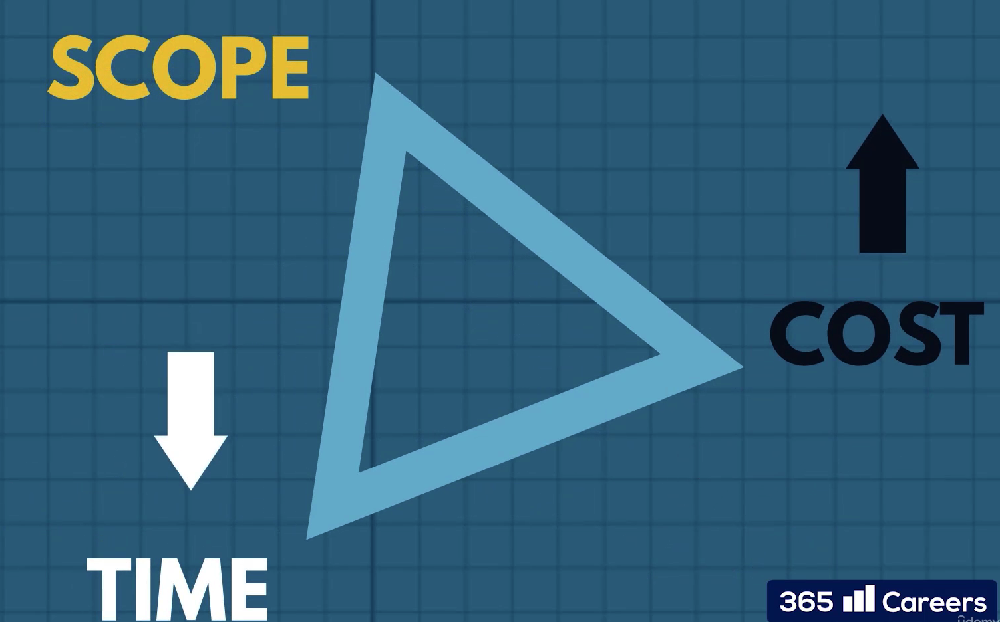
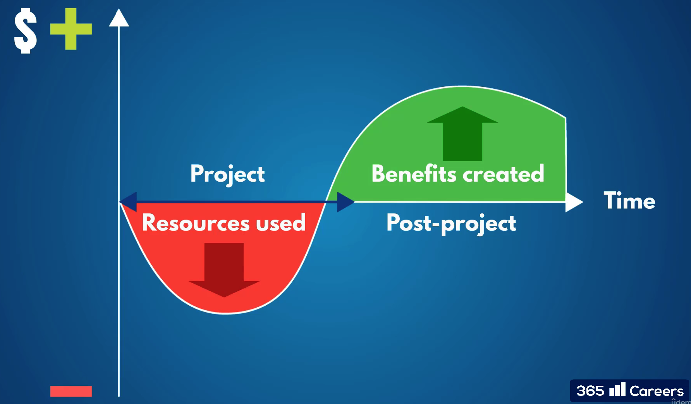
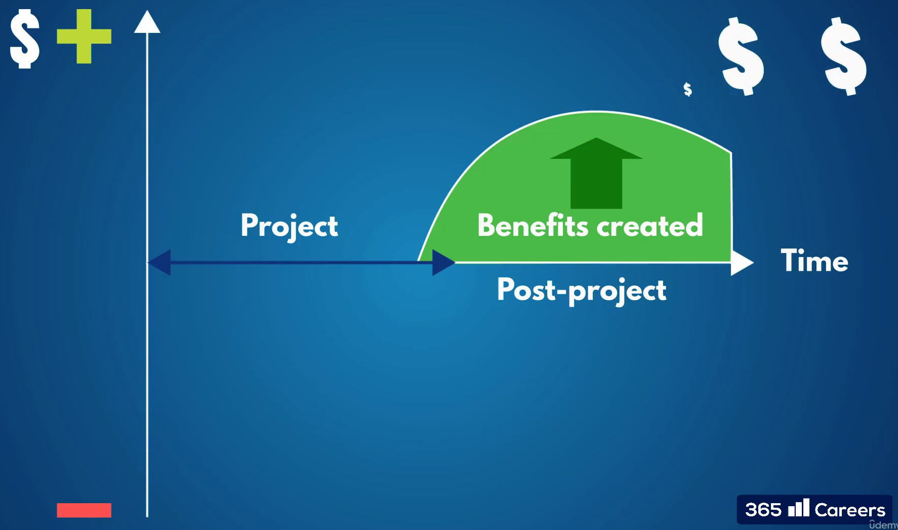

# Project Management Program

### PMP Test Process

Document Prerequisite:

* 4 years of Education
* Work Experience = 36 months leading projects
* 35 Hours of Project management education

PMP Exam

180 Questions

230 minute to complete the exam

Two 10 minute breaks

Pass/Fail

PMP Exam - Type of questions

* Multiple Choice
* Multiple responses
* Matching
* Hotspot
* Limited fill-in-the blank

### Project Management Terms

* A Project must have start date and the project must have end date
* A project can be part of large program or portfolio
* Temporary in nature and has definite beginning and ending
* A temporary endeavor that produces a unique product service or result.

### Project Management

Project managementis the application of knowledge, skills, tools and techniques to satisfy project requirements.

* Preparing a business case to justify the investment
* Estimating the reqources and times
* Developing and implementing a management plan for the project
* Leading and motivating the project delivery team
* Managing the risks, issues and change on the project
* Monitoring the progress against the plan
* Closting the project in controlled fashion

### Program Management

Group of related projects managed in a cooordinated way to obtain benefits and control not available from managing them individually

* Group of related projects managed in a coordinated way to obtain benefits and control not available from managing them individually
* Must be some value add in managing them together as a program
* A project may or may not be part of a program, but a program will always have projects
* Focuses on the project interdependencies and helps to determine the optimal approach for managing the

PMO (Project Management Office):

Organizational Structure that standardizes the process and dacilitates the sharing of resources, methodologies , tools and techniques

**Types:**

* **Supportive:** Supports the project manager, such as providing templates,training or lesson learned from other projects
* Controlling: Determines the framework or methodology and use of specific forms
* Directive: Controls the project. PM will be assigned and report to the PMO

PMO is providing standardization for all the project managers

**Portfolio Management:**

Porfolio is a collection of multiple programs or Projects or Subsidiarity Portfolios.

Portfolio managers works directly with Senior leadership. To achieve strategic goals Potfolio managers will help to plan out all the Programs and Projects under that.

**Operations Management:**

* Operations are opposite to project. Project has a start date adn end date. whereas operations dont have Start Date and End Date.
* They are Finance, Sales, Marketing, IT support are all called Operations.
* Consider the acquisition, development and utilization of resources that firms need to deliver the goods and services.

**Value of Projects:**

* What value will this project bring to the company upon completion?
* Why should we undertake this project?
* Money, Brand Reputation, Customer Service, New or Change product or service.

> Value is the key.

## Project Lifecycle

| Phase                  | Purpose                                                                                                                                |
| ---------------------- | -------------------------------------------------------------------------------------------------------------------------------------- |
| Initiation             | Foundation of the project is laid. Idea is analyzed and Validated                                                                      |
| Planning               | To successfully manage the project with given**Time** and **Budget**                                                       |
| Execution              | What are project manager roles? How to manage and motivate the team Ensure the team focus on project deliverables            |
| Monitoring and Control | Essential part of the project life cycle, to constantly oversee whether we will be able to complete the project within time and budget |
| Closure                | A phase when the project is completed. Complete the project with style 😄                                                              |

### **What is a Project?**

A **temporary** endeavour undertaken to create a **unique product**, **service** or **result**

* Temporary Initiative with Start Date and End Date. Will have strict expiry date.
* There will be GOAL - Project Output.
* Project Output + Work Done = Project Scope

> Scope of each project is unique. If the scope is same then it will not be called as Project. It is Operation.

* Cost is resources dedicated to accomplish Goal.

  

Change in one part of the Triangle will trigger change in other corners.

For Eg: If you want to pull end date of the project then Cost has to be increased or Scope has to be decreased or do both in certain situations

> Projects are complex initiatives. It should be in conjunct with Business

> Operations are carried away day to day , so ony that will have start date but no end date. Accouunting, Finance, Product, Sales, Marketing are operations.

[Project Management Course Notes](assets/20250611_002620_The_Project+management+course+-+Notes.pdf "Project Management Course")

Projects are specific type of Investment.

Inputs used are

* Financial resources
* Organizational resources
* Time

Output

Desired Benefits

Financial

Operational

Customer Related

Non Profit (for Eg: Social Welfare, Charity)

What create Project Demand?

A project must relate to a business strategy

* Market Need
* Business Need
  * Decreasing Cost
  * Optimizing Process
  * Increasing Revenues
* Technological Advancements
  * Automation
  * Upgradation
  * Migration
* Customer Request
* Legal Requirements
* Social Needs

Urgency is the key factor for Project selection

Board of directors will place the project based on selveral factors and add it to their portfolio - That will be managed by Project Portfolio Management (PPM)

Perfect! Since you’re aiming for **colorful, icon-rich content** like the Markdown version — but you’re using a **WYSIWYG editor** — I’ll reformat it for **rich-text** environments (like Notion, Word, or any visual editor that supports emojis, bold, spacing, etc.), while **preserving all the visual impact**.

Here’s the updated, **WYSIWYG-friendly**, colorful version with emojis and structured layout:

## 🧠 Understanding the Role of a Project Manager

### 📌 What is a Project?

A **project** is a **temporary initiative** that is:

- ✅*Agreed upon*
- ✅*Planned*
- ✅*Executed*

🎯 **Purpose**: To achieve a **specific goal** within defined time, cost, and scope.

---

### 👑 Who Owns the Project's Success?

The **Project Manager (PM)** is the **CEO of the project**.

🧾 **Responsible for**:

- Delivering the**goal**
- Within the**agreed time**
- And**budget**

---

### 🔺 Project Management Triple Constraint

A successful project must fit within:

1. ⏳**Time**
2. 💰**Cost**
3. 📦**Scope**

📣 By accepting the role, the PM agrees to meet the goal **within these constraints**.

---

### ⚠️ If Constraints Are Unrealistic...

The PM must:

- 🧠**Evaluate** the feasibility
- 📈**Negotiate** for:
  - More time
  - More resources
  - Adjusted goals
- 🚫 Has the right to**refuse** the project if it’s set up for failure

📌 In real life, time and resources are *just enough*. The PM must make the **most efficient use** of them.

---

### 💼 What Does It Mean to Be "Accountable"?

📖 **Definition**: Committing to achieve a result — and then **delivering** on that commitment.

🔍 PM is **accountable** for:

- Their own work
- The team’s work
- Support functions
- Vendors
- Stakeholders

📌 Any task affecting the project’s progress is the PM’s responsibility.

---

### 🪧 “The Buck Stops Here”

📜 **Meaning**: Responsibility **ends with me** — I won’t pass the blame.

🎲 **Origin**: From poker. To prevent cheating, a **buckhorn knife** marked the next dealer — “passing the buck” = passing responsibility.

👤 **Who said it?** 🇺🇸 **President Harry Truman** kept the sign on his desk to show **he alone takes responsibility**.

💡 **Lesson for PMs**: Don’t run from hard decisions. **Lead through challenges**.

---

### 🧰 Tools & Superpowers of a Project Manager

Despite the heavy accountability, PMs have:

- 🧠**Skills**
- 📚**Knowledge**
- 💪**Experience**

These help them:

- Make better decisions
- Guide teams
- Deliver successful projects

## 🧠 The Skills and Attributes of a Great Project Manager

### 👤 The Project Manager as the Face of the Project

- The**Project Manager (PM)** is the**main point of contact** for:
  - Questions
  - Concerns
  - Tasks (even those executed by others)

🧩 They manage:

- Tasks they may have**no direct experience in**
- **Experts** across various domains
- Stakeholders from**junior staff to CEOs**

🛠️ PMs are **accountable** for the entire project — and empowered to:

- Make decisions
- Take action
- Lead the full execution

---

## 🧰 3 Major Skill Areas of a Project Manager

---

### 1️⃣ Technical Skills & Knowledge

These are the **core project management competencies** — the *A to B* of managing projects.

📚 Includes:

- Understanding the**Triple Constraint** (Time ⏳, Cost 💰, Scope 📦)
- Knowing how these elements interrelate and how to manage them
- Mastering the**project lifecycle** phases
- Organizing complex expectations into structured plans

📄 Key tools a PM should be comfortable with:

- Project Charter
- Project Plan
- Gantt Chart
- Critical Path Method
- Risk Log
- Project Budget
- Status Reports

🧠 Must-have technical abilities:

- **Personal organization** – manage your own tasks effectively
- **Task management** – break down, assign, and track task progress
- **Critical thinking** – filter noise, focus on what matters
- **Tool usage** – create clean plans, tables, and presentations

💡 This course includes **templates, tools**, and **practical tips** to build these skills.

---

### 2️⃣ Interpersonal & Soft Skills

Projects are delivered **by people, for people**. These skills define how well PMs interact, adapt, and lead.

👥 People dynamics change with every project — new teams, new cultures, new challenges.

📌 Core interpersonal skills include:

#### 💬 Communication

- PMs spend**90% of their time communicating**
- Channels include meetings, emails, chats, and informal conversations
- Even**coffee-break chats** can reveal valuable insights!

#### 🧑‍🤝‍🧑 Team Management

- Define: What needs to be done, by**whom**, and**by when**
- Support team members when they face blockers
- Keep**motivation levels high** throughout the project

#### 🧭 Leadership

- Influence stakeholders
- Negotiate and**mediate conflicts**
- Set the tone and**lead by example**

#### 🌐 Social & Cultural Adaptability

- Global teams mean working with:
  - IT in Germany 🇩🇪
  - Sales in the US 🇺🇸
  - Finance in India 🇮🇳
  - CEO in Singapore 🇸🇬
- Adapt your:
  - **Communication style**
  - **Language**
  - **Behavior**

💡 Tip: Don’t just talk work. Discuss:

- Hobbies 🎨
- Sports ⚽
- Interests 🏕️

And yes — humor is 💯 welcome! It boosts morale, builds trust, and reduces stress.

---

### 3️⃣ Business Knowledge & Industry Experience

🎓 Does a PM need to be an **industry expert**?

🟡 Helpful, but not mandatory:

✅ Pros of industry experience:

- Easier planning with fewer uncertainties
- Smoother communication with stakeholders
- Better risk prediction

❗ But remember:
Being a **domain expert ≠ successful project manager**

📌 The *real* requirement: Be an **expert in Project Management** itself.

---

🚀 Let’s continue full speed ahead in becoming **true experts in Project Management**.

## 📚 Project Management Terminology Refresher

Now that we’ve covered:

- ✅ What a project is
- ✅ Why projects are executed
- ✅ What a project manager does
- ✅ Their skills and responsibilities
- ✅ A bit of history...

…it’s the perfect time to revisit some **essential terms** before jumping into the **Project Lifecycle**.

---

## 📘 Key Project Management Terminology

---

Before we dive into the **project lifecycle**, let’s take a moment to revisit and expand on some essential terms. This refresher will help set the foundation for everything that follows.

---

### 🏢 Project Management Office (PMO)

- The**PMO** is a**department** responsible for managing, coordinating, and consulting on all project-related work.
- Common roles in a PMO include:
  - Project Managers
  - Program Managers
  - Project Coordinators
  - Analysts

🏗️ **PMOs vary** by organization:

- Some organizations (e.g. consulting firms) are built entirely around a PMO structure.
- Others (e.g. industrial firms like steel manufacturers) may not need one at all.

📌 **Types of PMO Roles**:

- **Strategic PMO**: Focuses on project selection and portfolio management.
- **Execution-focused PMO**: Supports and standardizes project delivery, reporting, and oversight.

---

### 👥 Project Team

- The**project team** consists of the experts executing the project work.
- Example roles:
  - Developers (in software)
  - Construction workers and supervisors (in infrastructure)
  - Managers, coordinators, external consultants, vendors

🤝 Teams can be:

- Cross-departmental
- Cross-company
- Built to combine expertise from multiple domains (e.g., insurance + IT)

📌 Example:
In an **insurance software project**, IT specialists and insurance professionals from the client organization may work together as a **joint team** to ensure success from both technical and domain perspectives.

---

### 👀 Project Stakeholders

- **Stakeholders** are any individuals or organizations who:
  - Participate in the project
  - Influence the project
  - Are affected by the project

Examples include:

- Management
- Customers
- Competitors
- Vendors
- The public (in infrastructure projects)

📌 Real-World Example:If a **new metro line** is built next to your home, you are a **stakeholder**. You’re affected by the project and can even influence it through public/media pressure if delays occur.

> Stakeholders may influence a project **without being directly involved in it.**
> Yes, the **project manager and team are stakeholders** too.

---

### 📂 Program Management

- **Program Management** = Coordinated management of**related projects** with:
  - Shared goals
  - Shared resources
  - Similar timelines or domains

🎯 **Why manage as a program?**

- Enables**efficiencies and synergies**

📌 Example:
Implementing similar software across **multiple European branches** of a company.
Each country has its own project, but grouping them as a **program** allows better collaboration and consistency.

---

### 🗂️ Project Portfolio Management (PPM)

- **Portfolio Management** = Coordinated management of**multiple programs and projects** across the organization.

📌 Example:A **pharmaceutical company** may run **hundreds or thousands** of drug research projects simultaneously.They require strong PPM to track:

- Progress
- Budget
- Resource allocation
- Strategic alignment

---

✅ Now that we’ve refreshed our terminology, we’re ready to dive into the **Project Lifecycle** in the next lesson!

## 📘 Key Project Management Terminology

---

Before we dive into the **project lifecycle**, let’s take a moment to revisit and expand on some essential terms. This refresher will help set the foundation for everything that follows.

---

### 🏢 Project Management Office (PMO)

- The**PMO** is a**department** responsible for managing, coordinating, and consulting on all project-related work.
- Common roles in a PMO include:
  - Project Managers
  - Program Managers
  - Project Coordinators
  - Analysts

🏗️ **PMOs vary** by organization:

- Some organizations (e.g. consulting firms) are built entirely around a PMO structure.
- Others (e.g. industrial firms like steel manufacturers) may not need one at all.

📌 **Types of PMO Roles**:

- **Strategic PMO**: Focuses on project selection and portfolio management.
- **Execution-focused PMO**: Supports and standardizes project delivery, reporting, and oversight.

---

### 👥 Project Team

- The**project team** consists of the experts executing the project work.
- Example roles:
  - Developers (in software)
  - Construction workers and supervisors (in infrastructure)
  - Managers, coordinators, external consultants, vendors

🤝 Teams can be:

- Cross-departmental
- Cross-company
- Built to combine expertise from multiple domains (e.g., insurance + IT)

📌 Example:
In an **insurance software project**, IT specialists and insurance professionals from the client organization may work together as a **joint team** to ensure success from both technical and domain perspectives.

---

### 👀 Project Stakeholders

- **Stakeholders** are any individuals or organizations who:
  - Participate in the project
  - Influence the project
  - Are affected by the project

Examples include:

- Management
- Customers
- Competitors
- Vendors
- The public (in infrastructure projects)

📌 Real-World Example:If a **new metro line** is built next to your home, you are a **stakeholder**. You’re affected by the project and can even influence it through public/media pressure if delays occur.

> Stakeholders may influence a project **without being directly involved in it.**
> Yes, the **project manager and team are stakeholders** too.

---

### 📂 Program Management

- **Program Management** = Coordinated management of**related projects** with:
  - Shared goals
  - Shared resources
  - Similar timelines or domains

🎯 **Why manage as a program?**

- Enables**efficiencies and synergies**

📌 Example:
Implementing similar software across **multiple European branches** of a company.
Each country has its own project, but grouping them as a **program** allows better collaboration and consistency.

---

### 🗂️ Project Portfolio Management (PPM)

- **Portfolio Management** = Coordinated management of**multiple programs and projects** across the organization.

📌 Example:A **pharmaceutical company** may run **hundreds or thousands** of drug research projects simultaneously.They require strong PPM to track:

- Progress
- Budget
- Resource allocation
- Strategic alignment

---

✅ Now that we’ve refreshed our terminology, we’re ready to dive into the **Project Lifecycle** in the next lesson!
