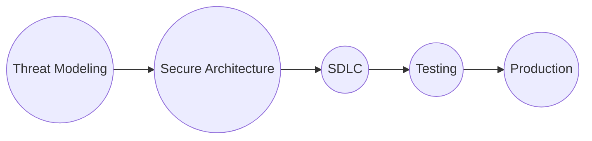

# Security

 - **Data Loss**  (Eg: Gain access to database and delete data)
 - **Disruption of Service** (Eg: DDOS Attack - Distributed denial of Service attack is attack against **Managed DNS**)
 - **Data Leak** (Eg: Stealing credit card information) 
 - **Data Inconsistency** (Attackers impersonate as someone else and perform unauthorized actions)

5 Stages of Secure Atchitecture Process

##### Threat Modeling
- A Process of identifying potential threats for the system
- Prioritize mitigations and measures
- Has a great effect on the work plan
- Involves almost everyone in the team
- Might utilize formal methods and tools

##### Secure Architecture
- Based on security perimeter paradigm
- Integrates security defences in to the core
- Touches all aspects of the system

##### SDLC
- Secure development lifecycle
- Actual development of the system
- Implement code level security measures

##### Testing
- Implement security related testing
- Analyze the result
- Compare to the threat modeling

##### Production
- Continous Monitoring
- Get up to date

### Threat Modeling
Identify potential threats for the system and discuss ways to mitigate them. It should be repeated.
Threat modeling should be very methodical. Everyone's input should be welcome.
#### How to do Threat modeling?
- What do we build?
- What can go wrong?
- How can we mitigate that?
- Did we succeed?

**What do we build?**

*Example*
>We are designing an HR System to manage the employee's data, including salary, vacations etc

**What can go wrong?**

The main threats the application might face based on
- Sensistive of the information the system store
- Its location
- Competition
- Any other factor that might be relevant

> Since we store sensistive data in the system we want to make sure it won't leak

**How can we mitigate that?** 
- Discuss mitigation to the potential threats.
- Research various mitigations method if needed.
- Make sure to include the mitigations in the work plan
- If the dev team does not know how to implement it -  design a training plan.

> All the sensistive data is going to be encrypted. In addition, database access will be given on a least privilege basis only"

**Did we succeed?**

> We are going to ask a security expert to extract and decrypt the encrypted data and see if she succeeds

**When to start Threat modeling?**
- At the beginning of the project
- After major changes
- Following security incident.

**How to start Threat modeling?**
- Meeting
- With a whiteboard
- And a supervisor
- And clear Agenda
- And someone who summarize
### Thread Modeling Methodologies
- Usually threat modelling is done using free-form discussions
- Some methodologies exist that formalise the process
- Most Organisations don't use them

**STRIDE**
- The most mature methodologies
- Developed in 1999
- Adopted by microsoft in 2002

Stride stands for 

>S - Spoofiing
T - Tampering
R - Repudiation
I - Information Disclosure
D - Denial of Service
E - Elevation of Privilege

When a potential threat does found a mitigation plan is formed.

Other Methodologies other than ***STRIDE*** are 
**PASTA**
**DREAD**
**Attack Tree**
**CVSS**
And more...

**Microsoft Threat Modeling Tool (TMT)**
- Used for a complete Threat Modeling Process
- Contains a visual designer to build Data Flow Diagram (*DFD*)
- Uses the STRIDE methodology
- Designed for Developers
- Stand-Alone app, requires installation.

**Threat Dragon**
- New app, still in early stages
- Developed by OWASP
- Electron based can be installed locally or used as web app

